# ☁️ Minha primeira instância EC2 na AWS

Provisionamento manual de um servidor Linux na nuvem da AWS (Amazon EC2) e acesso remoto via SSH, documentado passo a passo.


---

## Objetivo

Criar uma máquina virtual na AWS, e acessá-la remotamente pelo terminal usando autenticação por chave (SSH).

## Tecnologias e ambiente

| Item | Valor |
|---|---|
| Provedor de nuvem | AWS |
| Serviço | Amazon EC2 |
| Região | América do Sul — São Paulo (`sa-east-1`) |
| Sistema operacional | Amazon Linux 2023 (kernel 6.18) |
| Tipo de instância | `t3.micro` (2 vCPU, 1 GiB RAM) |
| Armazenamento | 8 GiB, EBS `gp3` |
| Cliente SSH | OpenSSH no terminal Linux local |

## Arquitetura

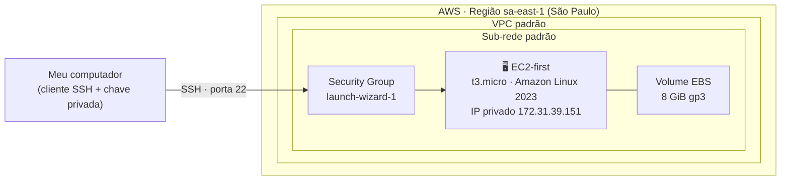
```mermaid
flowchart LR
    PC["Meu computador<br/>(cliente SSH + chave privada)"] -->|"SSH · porta 22"| SG
    subgraph AWS["AWS · Região sa-east-1 (São Paulo)"]
        subgraph VPC["VPC padrão"]
            subgraph SUB["Sub-rede padrão"]
                SG["Security Group<br/>launch-wizard-1"] --> EC2["🖥️ EC2-first<br/>t3.micro · Amazon Linux 2023<br/>IP privado 172.31.39.151"]
                EC2 --- EBS["Volume EBS<br/>8 GiB gp3"]
            end
        end
    end
```

---

## Conceitos essenciais

Antes do passo a passo, os termos que aparecem durante o processo:

- **Nuvem (cloud):** usar computadores de um provedor (aqui, a AWS) pela internet, pagando pelo uso, em vez de comprar e manter hardware próprio.
- **EC2 (Elastic Compute Cloud):** serviço da AWS que aluga máquinas virtuais. "Elastic" porque você cria, aumenta ou destrói máquinas conforme a necessidade.
- **Instância:** cada máquina virtual criada no EC2. É um "computador" que roda dentro de um servidor físico da AWS.
- **Região:** local geográfico onde ficam os data centers. Escolhi São Paulo (`sa-east-1`) pela menor latência (menor atraso de rede).
- **AMI (Amazon Machine Image):** o "molde" da máquina: contém o sistema operacional e softwares pré-instalados. Toda instância nasce a partir de uma AMI.
- **SSH (Secure Shell):** protocolo para acessar e controlar um computador remoto pelo terminal, com a comunicação criptografada.

---

## passo a passo

### 1. Nome da instância

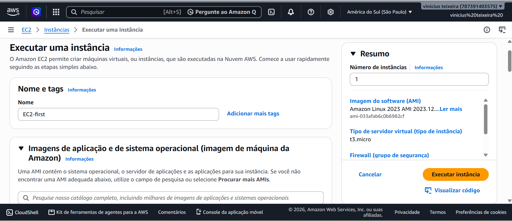

Nomeei a instância como **`EC2-first`**. O nome é, na verdade, uma **tag** (etiqueta chave-valor: `Name = EC2-first`). 

### 2. Sistema operacional (AMI)

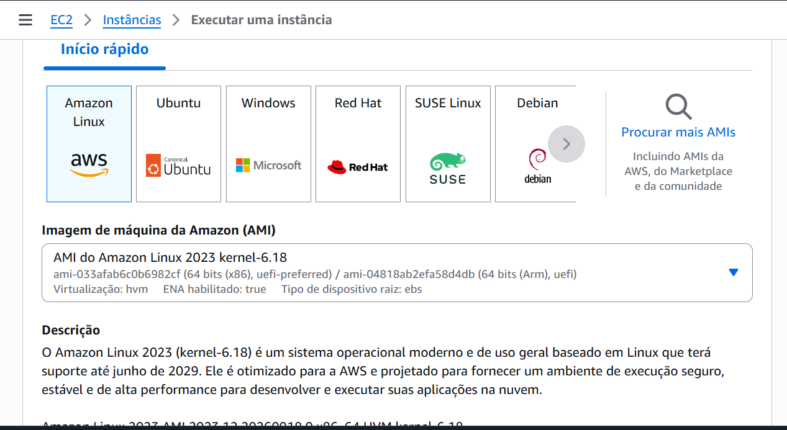

Escolhi a **AMI do Amazon Linux 2023**. 

### 3. Arquitetura

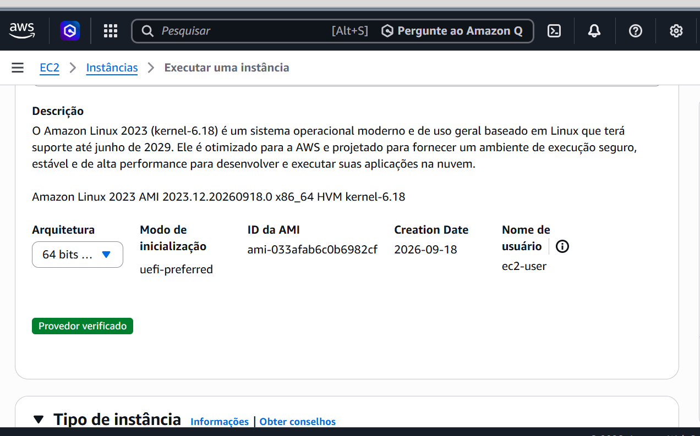

- **Arquitetura: 64 bits (x86):** mantive x86 por ser o padrão.
- **Nome de usuário: `ec2-user`:** usuário padrão já criado nessa AMI. É com ele que faço login via SSH depois.

### 4. Tipo de instância

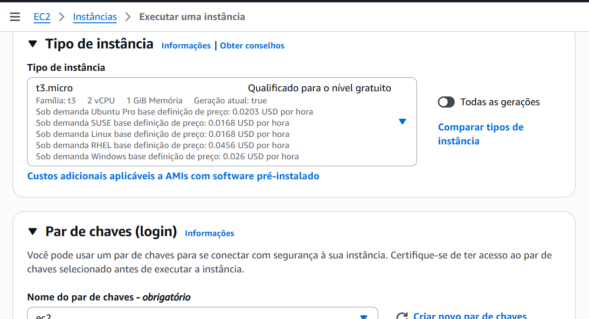

Escolhi **`t3.micro`**: **2 vCPU** e **1 GiB de memória**, qualificada para o nível gratuito.

Lendo o nome:
- **`t`** = família *burstable* (de "rajada"): a máquina acumula créditos de CPU enquanto está ociosa e os gasta em picos de uso. Ideal para testes e cargas leves.
- **`3`** = geração da família.
- **`micro`** = tamanho (nano < micro < small < medium < large...).
- **vCPU** = CPU virtual, uma fatia de um núcleo físico do servidor.

Preço sob demanda com Linux nessa região: **0,0168 USD por hora**.

### 5. Par de chaves (login)

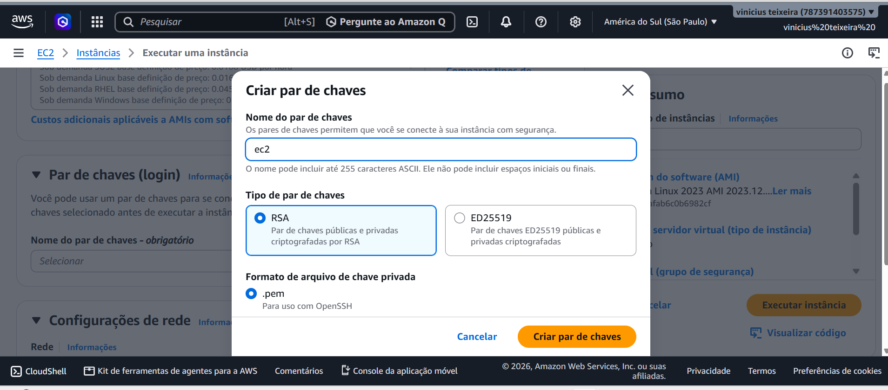

Criei um par de chaves chamado **`ec2`**, do tipo **RSA**, no formato **`.pem`** (usado pelo OpenSSH).

**Como funciona (analogia que me ajudou a entender ):** a **chave pública** é um cadeado e a **chave privada** é a única chave que o abre. A AWS instala o cadeado (chave pública) dentro da instância; eu fico com a chave (arquivo `ec2.pem`), baixada **uma única vez**. Quem tiver esse arquivo entra na máquina, por isso ele nunca pode ser compartilhado nem enviado ao GitHub.


### 6. Configurações de rede

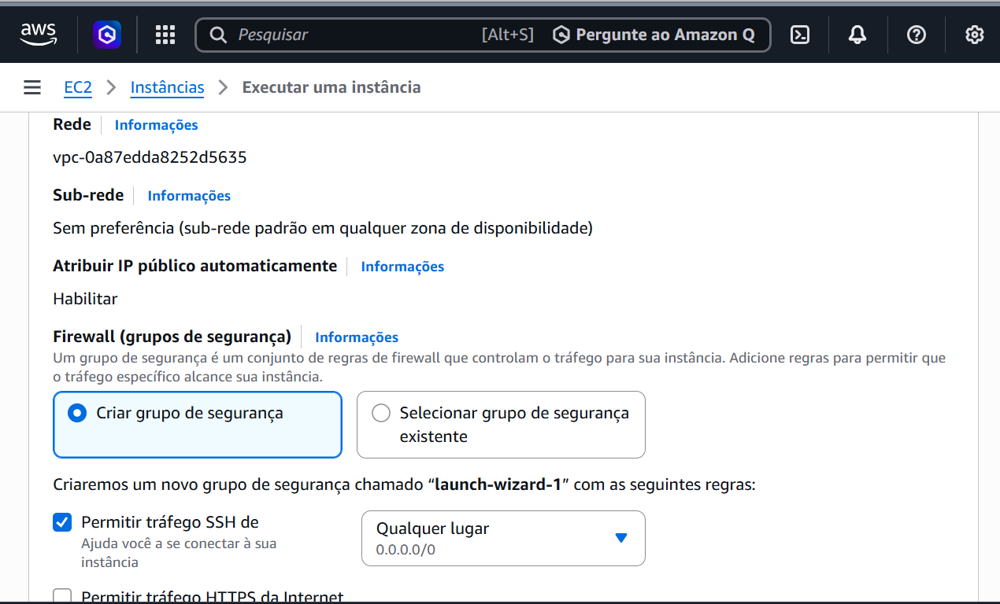

- **VPC (Virtual Private Cloud):** uma rede privada e isolada dentro da AWS, só da minha conta. Usei a VPC padrão.
- **Sub-rede:** uma divisão da VPC, ligada a uma **zona de disponibilidade** (um data center dentro da região). Deixei "sem preferência".
- **Atribuir IP público automaticamente: Habilitar** — sem IP público, a máquina não seria acessível pela internet, e eu não conseguiria conectar do meu computador.
- **Security Group (grupo de segurança):** o firewall da instância. Ele define **quais conexões podem entrar**. Foi criado o grupo `launch-wizard-1` com uma regra liberando **SSH (porta TCP 22)**.
- **Origem `0.0.0.0/0`:** notação CIDR que significa "qualquer endereço IPv4 do mundo".

### 7. Armazenamento

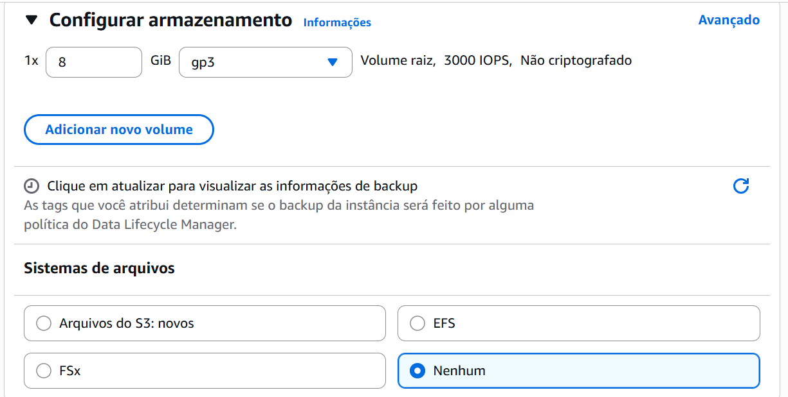

- **1 volume de 8 GiB, tipo `gp3`**, como volume raiz (onde o sistema operacional está instalado).
- **EBS (Elastic Block Store):** o "HD/SSD" da instância. Fica separado da máquina e conectado a ela pela rede da AWS.
- **`gp3`:** SSD de uso geral, geração atual, com desempenho base de **3000 IOPS** (operações de leitura/escrita por segundo).
- **Não criptografado:** aceitável para um laboratório; em produção, o recomendado é ativar a criptografia.
- **Sistemas de arquivos (S3, EFS, FSx): Nenhum** — são armazenamentos compartilhados/de rede, desnecessários para um servidor único de testes.

### 8. Instância criada

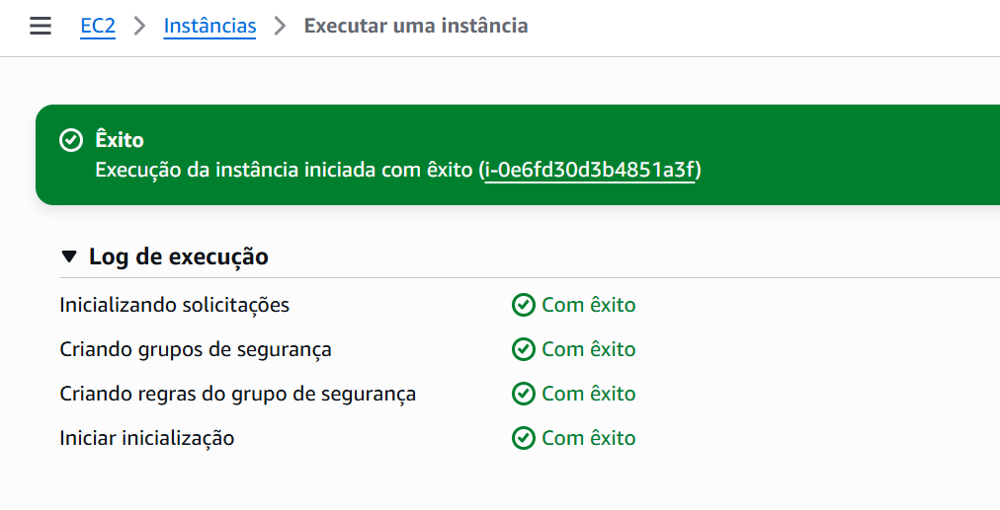

A AWS executou as etapas: criou o grupo de segurança, suas regras e iniciou a máquina. ID gerado: `i-0e6fd30d3b4851a3f`.

### 9. Resumo da instância

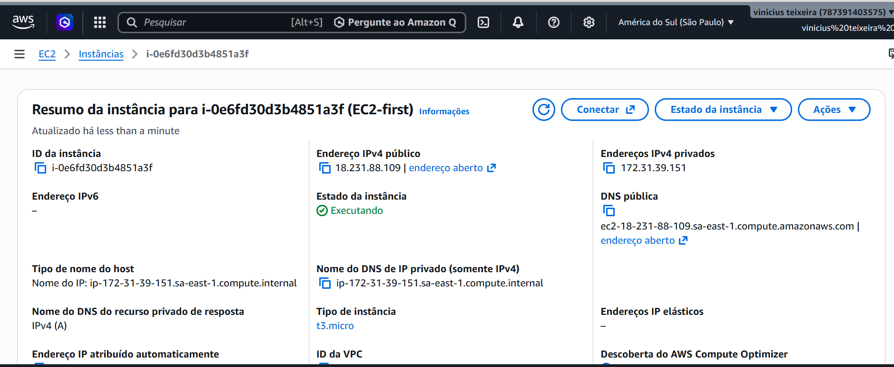

Estado **Executando**. Os dados mais importantes:

| Campo | Valor | Para que serve |
|---|---|---|
| IPv4 público | `18.231.88.109` | Endereço acessível pela internet |
| IPv4 privado | `172.31.39.151` | Endereço interno, visível só dentro da VPC |
| DNS público | `ec2-18-231-88-109.sa-east-1.compute.amazonaws.com` | Nome que aponta para o IP público |
| IP elástico | — (nenhum) | Sem IP fixo: o IP público **muda** se a instância for parada e iniciada de novo |

### 10. Instruções de conexão

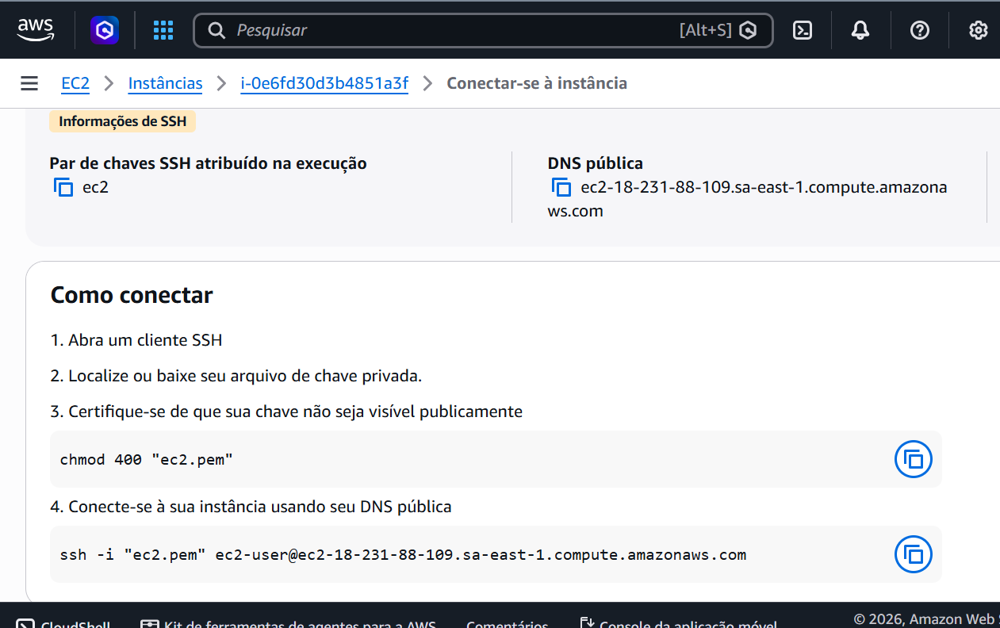

A própria AWS mostra os dois comandos necessários: proteger a chave (`chmod 400`) e conectar (`ssh -i`).

### 11. Protegendo a chave privada

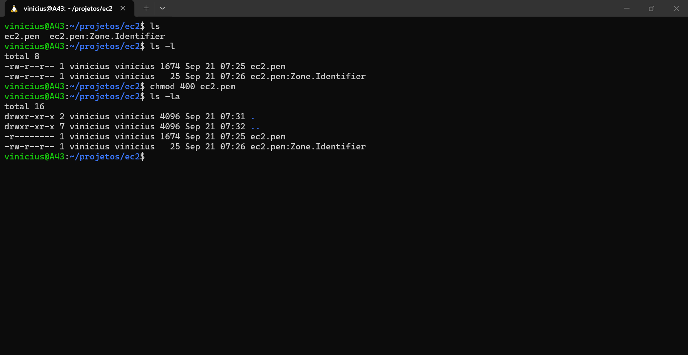

```bash
chmod 400 ec2.pem
```

> O arquivo `ec2.pem:Zone.Identifier` é um metadado criado pelo Windows ao baixar arquivos da internet, que aparece quando o arquivo é copiado para o ambiente Linux (WSL). Não tem função aqui e pode ser apagado.

### 12. Login via SSH

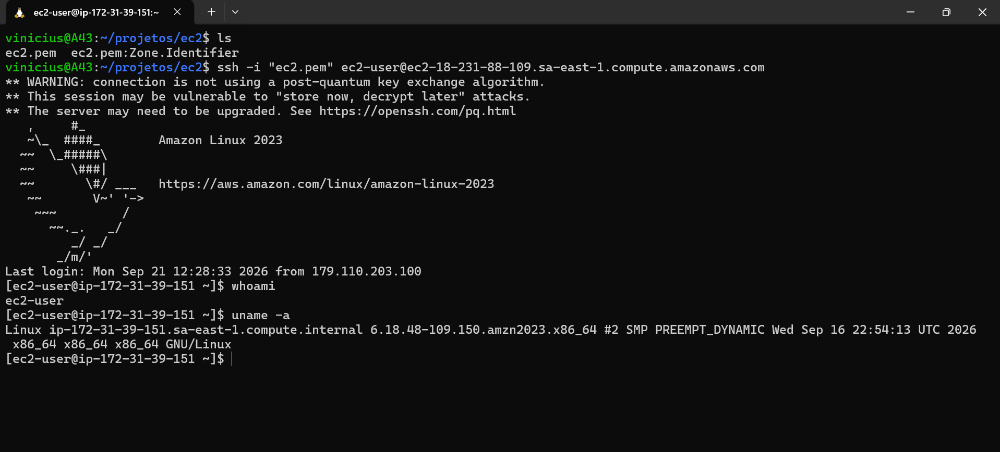

```bash
ssh -i "ec2.pem" ec2-user@ec2-18-231-88-109.sa-east-1.compute.amazonaws.com
```

Anatomia do comando:
- `ssh` → programa cliente SSH.
- `-i "ec2.pem"` → *identity file*: a chave privada usada para me autenticar.
- `ec2-user` → usuário no servidor.
- `@ec2-18-...amazonaws.com` → endereço do servidor.

O prompt mudou de `vinicius@A43` (meu computador) para `[ec2-user@ip-172-31-39-151 ~]$` (o servidor na nuvem), confirmando o acesso. Validei com:

```bash
whoami     # retorna o usuário logado → ec2-user
uname -a   # informações do sistema → Linux, kernel 6.18 (amzn2023), arquitetura x86_64
```
---

## Parte 2 — Security Grups

na Parte 1, o SSH ficou liberado para `0.0.0.0/0` (qualquer IP). Aqui investiguei os grupos de segurança existentes e criei um grupo próprio com regras mais específicas.

### Conceitos

- **Security Group = firewall da instância.** Ele fica ligado à **interface de rede (ENI)** da instância, a "placa de rede virtual" dela.
- **Só existem regras de permissão.** Não há regra de "bloquear": tudo que não foi permitido está bloqueado.
- **Stateful (com estado):** se uma conexão de entrada é permitida, a resposta sai automaticamente, e vice-versa. O firewall "lembra" das conexões abertas.
- **Vários grupos na mesma instância = soma das regras.** Se *qualquer* regra de *qualquer* grupo permitir o tráfego, ele passa.
- **Regras de entrada (inbound):** quem pode chegar até a instância. **Regras de saída (outbound):** para onde a instância pode se conectar.
- **Portas usadas:** `22` = SSH (acesso remoto), `80` = HTTP (web sem criptografia), `443` = HTTPS (web criptografada).
- **CIDR:** forma de escrever faixas de IP. `/32` = exatamente **um** endereço IPv4; `0.0.0.0/0` = todos os IPv4; `::/0` = todos os IPv6.

### 13. Recursos em uso

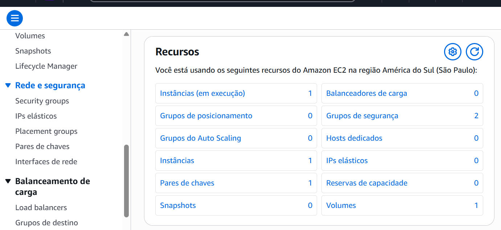


##Grupos existentes

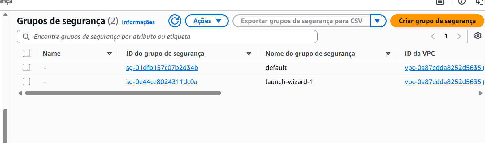

| Grupo | Origem |
|---|---|
| `default` | Criado automaticamente pela AWS junto com a VPC padrão |
| `launch-wizard-1` | Criado pelo assistente na hora de lançar a instância (Parte 1, passo 6) |

### 15–16. Grupo `default`

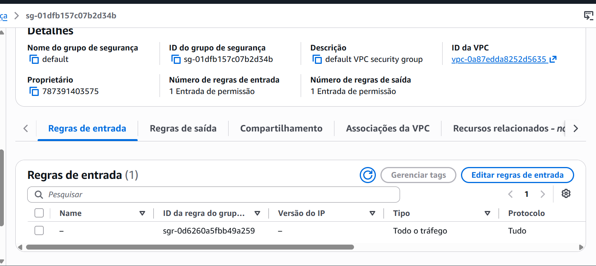
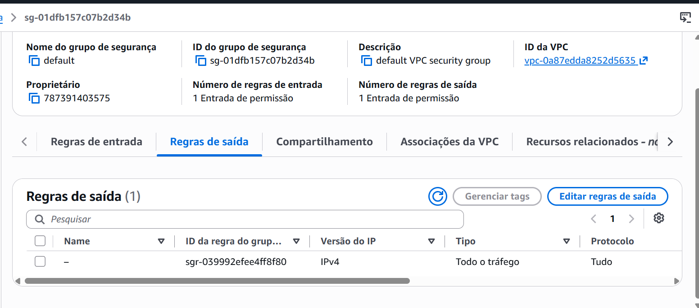


### 17–18. Grupo `launch-wizard-1`

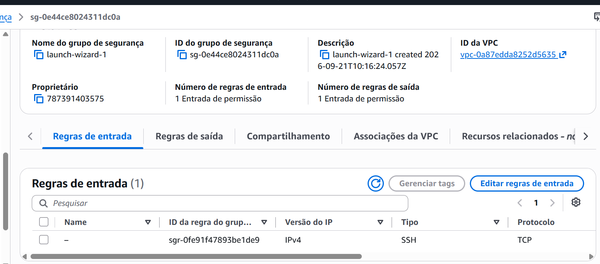
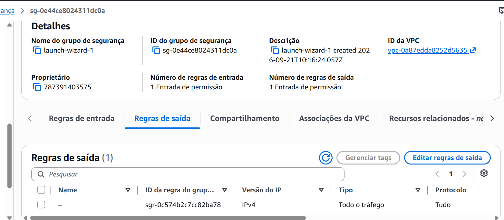


### 19–20. Restringindo a origem do SSH

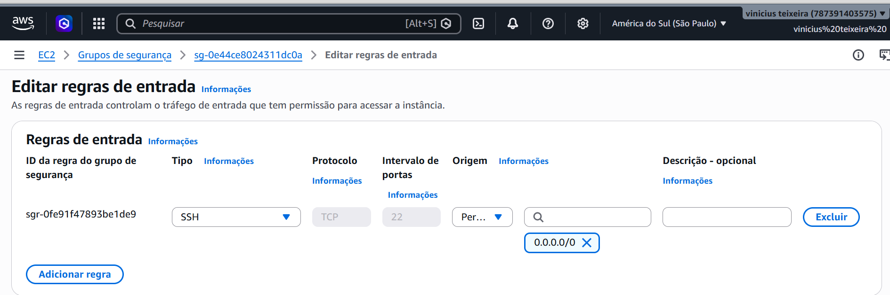
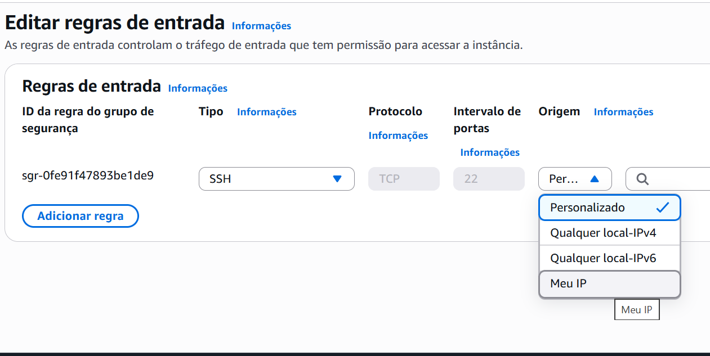

Na edição da regra de entrada, o campo **Origem** oferece a opção **"Meu IP"**: a AWS detecta o IP público de onde estou acessando e o preenche com `/32`, liberando o SSH **apenas para esse endereço**.

### 21. Criando um grupo próprio

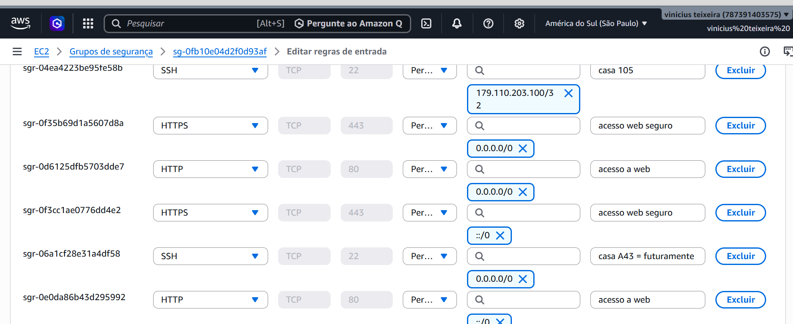

Criei o grupo **`my securite group`** com regras que já preparam a instância para servir páginas web:

| Tipo | Porta | Origem | Descrição | Objetivo |
|---|---|---|---|---|
| SSH | 22 | meu IP `/32` | casa 105 | Administração só a partir da minha rede |
| HTTP | 80 | `0.0.0.0/0` e `::/0` | acesso a web | Site acessível por qualquer pessoa (IPv4 e IPv6) |
| HTTPS | 443 | `0.0.0.0/0` e `::/0` | acesso web seguro | Idem, com criptografia |
| SSH | 22 | `0.0.0.0/0` | casa A43 = futuramente |

**Decisão:** HTTP/HTTPS abertos para o mundo são normais, porque um site precisa ser público. Enquanto nenhum servidor web estiver rodando, essas portas simplesmente não respondem. Já o SSH é acesso administrativo e deve ser o mais restrito possível.


### 22–23. Associando o grupo à instância

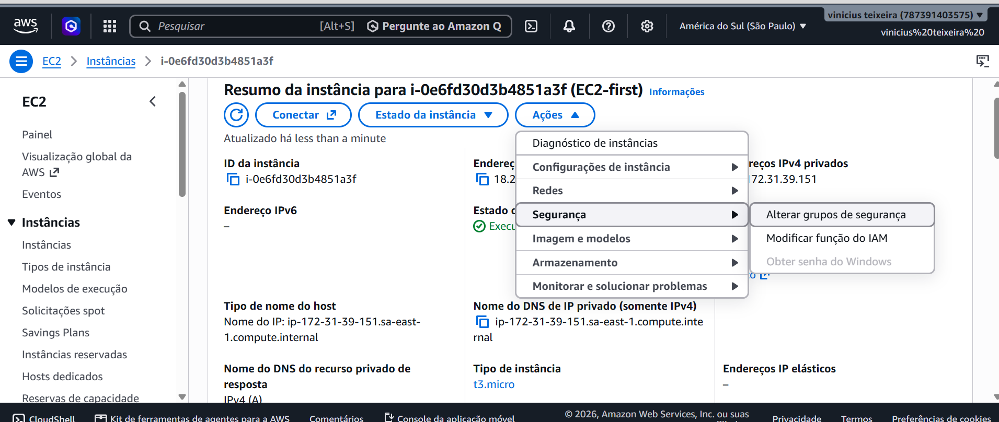
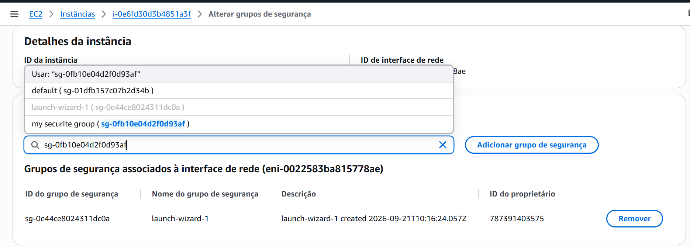

Caminho: **Instância → Ações → Segurança → Alterar grupos de segurança**. Busquei o novo grupo pelo ID (`sg-0fb10e04d2f0d93af`) e cliquei em **Adicionar grupo de segurança**.


---
